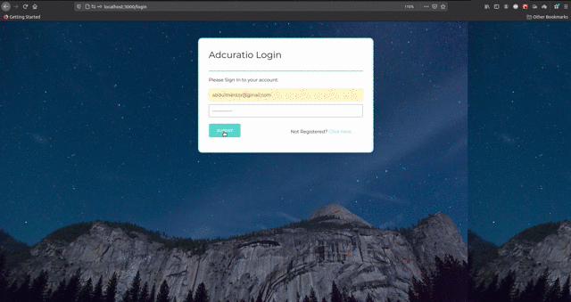

# Adcuratio

## Folder 1 : frontend

- The frontend is written in React.

### How to run it:

```
cd frontend
npm install
npm start
```

## Folder 2 : backend

- The backend is written in nodejs [Node 14 is must!].

### How to run it:

```
cd backend
npm install
npm start
```

### Demo:

- There is an .mp4 and .gif file in the working-demo folder showing the complete task demo.

